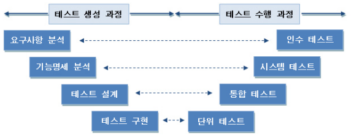
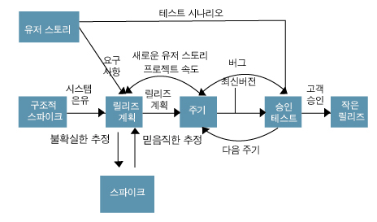

# 정보처리기사 [필기]

TOC

-----

## 1. 소프트웨어 설계

### 1. 소프트웨어 공학의 개념

- 소프트웨어(Software)의 개념

  - 소프트웨어(Software) : 컴퓨터를 동작시키고 어떤 일의 처리 순서와 방법을 지시하는 명령어의 집합인 프로그램과 프로그램의 수행에 필요한 절차, 규칙, 관련 문서등을 총칭

  - 프로그램 (Program) : 컴퓨터를 통해 일련의 작업을 처리하기 위한 명령어와 관련된 데이터의 집합

  - 자료구조 (Data Structure) : 컴퓨터 기억 장치 내에 자료의 표현, 처리, 저장 방법 등을 총칭하는 것으로 데이터 간의 논리적 관계나 처리 알고리즘

  - 문서 (Paper) : SW를 개발함에 있어 사용자 설명서, 소프트웨어 요구분석서, 평가서, 명세서, 프로젝트 계획서, 검사 계획서 등

- 소프트웨어의 특징 : **상품성, 복잡성, 변경 가능성, 복제성**

- 시스템(System)의 개요와 기본요소
  - 시스템의 개요 : 컴퓨터 처리 가능 자료를 입력 저장 처리 가공해 출력할수 있도록 설계된 정보체계 / 하나의 목적을 위해 다양한 요소가 유기적으로 결합
  - 기본요소 : **입력, 처리, 출력, 제어, 피드백**
- 소프트웨어 위기 (Software Crisis)
  - 컴퓨터의 발달과정에서 SW의 개발속도가 HW의 개발속도를 따라가지 못해 사용자들의 요구사항을 감당할 수 없는 문제가 발생
  - 위기의 원인 : **하드웨어 비용을 초과하는 개발 비용의 증가** / **개발 기간의 지연** / **개발 인력 부족 및 인건비 상승** / **성능 및 신뢰성 부족** / **유지보수의 어려움에 따른 엄청난 비용**

- 소프트웨어 공학 (Software Engineering)의 이해
  - 경제적으로 신뢰도 높은 SW를 만들기 위한 방법, 도구와 절차들의 체계
  - IEEE(전기전자학회(미국))는 SW의 개발, 운용, 유지보수 및 파기에 대한 체계적인 접근방법이라 정의
- 소프트웨어 공학의 기본원칙
  - 현대적인 프로그래밍 기술을 적용 / 신뢰성 / 사용편리성 / 유지보수성 / 지속적 검증 시행 / 결과에 대한 명확한 기록 유지 / 사용자 원하는 대로 동작 / 최신프로그램 언어, 최신 알고리즘 사용 현황 확인 / SW 개발비용 최소화 / 개발 단계와 소스 코드등의 문서화를 통해 명확성을 유지
- 공학적으로 좋은 SW의 조건
  - 신뢰성 높고 효율적, 사용자 의도대로 동작 / 편리성 제공 및 잠재적 에러 최소화 / 유지보수성 용이
- SW 공학 계층 구조
  - 도구 : 프로세스와 방법을 처리하는 기능을 제공하는 것
  - 방법론 : SW를 설계하는데 기술적인 방법을 제공하는 것
  - 프로세스 : SW의 가장 기초가 되며 개발에 사용하는 방법론과 도구가 적용되는 순서를 의미
- SW 품질
  - 사용자 요구대로 만들어져야 함 / 유지보수 쉬움 / 에러 최소화 / 초반에 정한 비용 맞춰 개발 / 정확한 결과 도출 / 원하는 시간에 원하는 기능 수행
- SW 공학의 목표
  - SW의 생산성과 품질 향상 / 최소의 비용으로 단기간에 시스템에 적합한 SW개발

### 2. 재공학

- 소프트웨어 재공학(Software Reengineering)의 개념
  - SW Crisis를 개발 생산성이 아닌 유지 보수의 생산성으로 해결하려는 방법
  - 현재의 시스템을 변경하거나 재구조화
  - 재구조화는 재공학의 한 유형, 사용자의 요구사항이나 기술적 설계의 변경 없이 프로그램을 개선
  - SW 재공학 관점에서 가장 연관깊은 유지보수 유형은 예방 유지보수(Preventive Maintenance)
- 재공학의 장점, 목표, 과정
  - 장점 : 개발 시간 및 비용 감소, 품질 향상, 생산성 향상, 신뢰성 향상, 구축 방법에 대한 지식의 공유, 프로젝트 실패 위험 감소
  - 목표 : SW의 유지보수성 향상이 최우선 목표, 복잡한 시스템 다루는 방법 구현, 다른 뷰의 생성, 잃어버린 정보의 복구 및 제거, 재사용 수월, SW 수명 연장
  - 과정 : **분석(Analysis) > 구성(Restructuring) > 역공학(Reverse Engineering) > 이식(Migration)**
- 재공학의 과정
  - 분석 : 기존 SW의 명세서를 확인, SW의 동작을 이해하고 재공학 대상을 선정
  - 재구성 : SW 구조를 향상시키기 위해 코드를 재구성
  - 역공학 : 원시코드를 분석해 SW 관계를 파악하고 기존 시스템의 설계 정보를 **재발견해 다시 제작**
  - 이식 : 기존 SW 시스템을 새로운 기술 또는 HW 환경에서 사용할 수 있도록 변환
- 리팩토링(Refactoring)
  - SW를 보다 쉽게 이해할 수 있고, 적은 비용으로 수정할 수 있도록 겉으로 보이는 동작의 변화 없이 내부 구조를 변경

- CASE (Computer Aided Software Engineering)
  - SW 개발과정에서 사용되는 요구분석, 설계, 구현, 검사 및 디버깅 과정을 컴퓨터와 전용 SW 도구를 사용해 자동화 하는 작업
  - 자료 흐름도 등 다이어그램을 쉽게 작성토록 해주는 SW도구
  - 작업과정 및 데이터 공유를 통해 작업자간의 커뮤니케이션 증대
- CASE가 제공하는 기능
  - 개발을 신속하게, 오류 수정을 쉽게, SW 품질 향상
  - SW 생명주기의 전체 단계 연결, 자동화시켜주는 통합된 도구 제공 기술
  - SW 시스템의 문서 및 명세화를 위한 그래픽 기능 제공
  - SW 개발단계의 표준화를 기할 수 있으며 자료 흐름도 작성기능 제공
  - 모델들 사이의 모순 검사 기능 제공, 다양한 SW 개발모형 지원
  - 원천기술 : 구조적 기법, 프로토타이핑 기술, 정보 저장소 기술
- CASE 사용의 장점
  - SW 개발 기간 단축 및 개발 비용 절약으로 SW 생산성 향상
  - 자동화된 검사를 통한 SW 품질 향상
  - 프로그램의 유지보수 간편, SW 모듈의 재사용성 향상
  - SW 개발 주기의 표준안 확립, Sw 개발 기법의 실용화, 문서화등의 용이성 제공, 시스템 수정 및 유지보수 축소
- CASE의 분류
  - 상위(Upper) CASE : 요구분석 및 설계 단계 지원
  - 하위(Lower) CASE : 소스코드 작성, 테스트, 문서화 과정 지원
  - 통합(Integrate) CASE : SW 개발 주기 전체 과정 지원

- 요구사항 분석을 위한 CASE
  - 요구사항 자동분석, 요구사항 분석명세서 기술토록 개발된 도구
  - 표준화와 보고를 통한 문서화 품질 개선, 변경 영향 추적 용이, 명세 유지보수 비용 축소, 교차 참조도와 보고서를 통함 결함, 생략, 불일치등의 발견 용이성
  - 모두가 이용 가능한 DB로 분석자들간의 적절한 조정 기능
- 요구사항 분석을 위한 CASE 도구
  - **SADT(Structured Analysis and Design Technique)** : SoftTech사 개발, 구조적 요구분석을 하기 위해 **블록 다이어그램**을 채택한 자동화 도구
  - SREM(Software Requirements Engineering Methodology) : TRW 사 개발, 실시간 처리 SW 시스템에서 요구사항을 명확히 기술하도록 할 목적으로 개발, RSL과 REVS를 사용
    - RSL : 요소, 속성, 관계, 구조들을 기술하는 요구사항 기술언어
    - REVS : RSL로 기술된 요구사항들을 자동으로 분석해 요구사항 분석 명세서를 출력하는 분석기

### 3. 소프트웨어 개발 방법론

- 소프트웨어 생명주기(Software Life Cycle)
  - SW 제품의 개념 형성에서 시작해 운용/유지보수에 이르기까지 변화의 모든 과정
  - 타당성 검토 > 개발 계획 > 요구사항 분석 > 설계 > 구현 > 테스트 > 운용 > 유지보수
- 폭포수 모형(Waterfall Model)의 개요
  - 선형 순차적 모델, Boehm이 제시한 고전적 생명주기 모형
- 나선형 모형(Spiral Model)
  - Boehm 제시, 반복적 작업 수행하는 점증적 생명주기 모형
  - 점증적 모형, 집중적 모형이라고 하며 유지보수 과정 필요 X
  - SW 개발 중 발생할 수 있는 위험을 관리하고 최소화하는 것이 목적
  - 나선을 따라 돌아가며 각 개발 순서를 반복 수행하는 점진적 방식으로 누락된 요구사항 추가가능
  - 계획 및 초기 요구분석 > 1차 위험분석 > 1차 프로토타입 개발 > 1차 고객평가 > (**계획수립 > 위험분석 > 개발 및 검증 > 고객 평가**) > 반복
- 나선형 모형의 개발 단계
  - 계획수립 : 기능, 제약등의 세부적 계획단계
  - 위험분석 : 위험 요소 분석 및 해결 방안 설정 단계
  - 개발 및 검증 : 기능 개발 및 검증 단계
  - 고객 평가 및 다음 단계 수립 : 결과물 평가 및 추후 단계 진행 여부를 결정
- 하향식과 상향식 설계
  - 하향식 설계 : SW 설계 시 제일 상위에 있는 Main User Function에서 시작해 기능을 하위 기능들로 나눠가며 설계하는 방식
  - 상향식 설계 : 기본적인 컴포넌트를 먼저 설계한 다음 상위 수준의 컴포넌트를 설계하는 방식
- 프로토타입(Prototype Model)의 개요
  - 실제 개발될 시스템의 견본(Prototype)을 미리 만들어 최종 결과물을 예측하는 모형
  - 개발 완료 후에 문제점을 알 수있는 폭포수 모형의 단점을 보완키 위한 모형
- HIPO(Hierarchy Input Process Output)
  - 입력, 처리, 출력으로 구성되는 시스템 분석 및 설계와 시스템 문서화용 기법
  - 일반적으로 **가시적 도표(Visual Table of Contents), 총체적 다이어그램 (Overview Diagram), 세부적 다이어그램(Detail Diagram)** 으로 구성
  - 구조도(가시적 도표), 개요, 도표(Index Diagram), 상세도표로 구성
  - 가시적 도표는 전체적 기능과 흐름을 보여주는 구조
  - 기능과 자료의 의존관계 동시 표현 가능
  - 보기 쉽고 이해하기 쉬우며 유지보수 용이
  - 하향식 소프트웨어 개발을 위한 문서화 도구
- V-모델
  - 폭포수 모형에 시스템 검증과 테스트 작업을 강조한 모델
  - 세부적 프로세스로 구성되어 신뢰도 높은 시스템 개발에 효과적
  - 생명주기 초반부터 테스트 작업 지원
  - 코드 뿐만 아니라 요구사항과 설계 결과도 테스트 할 수 있어야 함
  - 폭포수 모형보다 반복과 재처리 과정 명확
  - 테스트 작업을 단계별로 구분하므로 책임이 명확
  - 

- 애자일(Agile) 개발 방법론
  - 특정 방법론이 아닌 SW를 빠르고 낭비없이 제작키 위해 고객과에 협업에 초점, 설계 변경에 신속히 대응해 요구사항을 수용가능
  - 절차와 도구보다 개인과 소통을 중시, 고객과의 피드백 중시
  - SW가 잘 실행됨에 가치를 두며 SW 배포 시차를 최소화 가능
  - 특징 : 짧은 릴리즈와 반복, 점증적 설계, 사용자 참여, 문서 최소화, 비공식적인 커뮤니케이션 변화
  - 종류 : 익스트림프로그래밍(XP), 스크럼(Scrum), 린(Lean), DSDM(Dynamic System Development Method), FDD(Feature Driven Development), Crystal, ASD(Adaptive Software Development), DAD(Disciplined Agile Delivery)
- Agile 선언문
  - 프로세스나 도구보다 개인과의 소통이 중요 / 완벽한 문서보다 실행되는 SW가 중요 / 계약 협상보다 고객과의 협업이 중요 / 계획 이행보다 변경에 대한 응답이 중요

- XP(eXtreme Programming)

  - 1999 Kent Beck 제안, 개발 단계 중 요구사항이 시시각각 변동이 심한 경우 적합한 방법론
  - 요구에 맞는 양질의 SW 신속하게 제공 목표
  - 요구사항을 모두 정의해 놓고 작업을 진행 X, 요구사항이 변경되는 것을 적용하는 방식으로 예측성보다 적응성에 높은 가치 부여
  - 고객의 참여와 개발 과정의 반복을 극대화해 생산성을 향상

- XP 핵심 가치

  - 소통(Communication) : 개발자, 관리자, 고객 간의 원활한 소통을 지향
  - 단순성(Simplicity) : 부가적 기능 또는 미사용 구조와 알고리즘은 배제
  - 피드백(Feedback) : SW개발에서 변화는 불가피, 이러한 변화는 지속적 테스트와 통합, 반복적 결함 수정 등 빠르게 피드백
  - 용기(Courage) : 고객 요구사항 변화에 능동적으로 대응
  - 존중(Respect) : 개발 팀원간의 상호 존중

- XP Process

  - 
  - User Story : 일종의 요구사항으로 UML의 유즈케이스와 같은 목적으로 생성되나 형식이 없고 고객에 의해 작성
  - Release Planning : 몇 개의 스토리가 적용되어 부분적으로 기능이 완료된 제품을 제공, 부분/전체 개발 완료 시점에 대한 일정 수립
  - Iteration : 하나의 릴리즈를 세분화 한 단위, 1~3주 단위로 진행, Iteration(반복) 진행 중 새 스토리가 추가될 때 진행 중 반복이나 다음 반복에 추가 가능
  - Acceptance Test : 릴리즈 단위의 개발이 구현되었을 때 진행하는 테스트, 유저 스토리 요구사항을 확인해 고객이 직접 테스트, 오류 발견 시 다음 반복에 추가, 테스트 후 고객 요구사항에 따라 우선순위 변경 가능, 완료 후 다음 반복 진행
  - Small Realease : 릴리즈 단위를 기능별로 세분화 해 고객의 반응을 기능별로 확인 가능, 완제품일 때 고객에 의한 최종 테스트 진행 후 고객에게 제공

- XP의 12가지 실천사항(Practice)

  | 구분                 | 12 실천사항               | 설명                                                         |
  | -------------------- | ------------------------- | :----------------------------------------------------------- |
  | Fine Scale Feedback  | Pair Programming          | 두 사람이 짝이되어 한사람을 코딩, 한사람은 검사 수행 / 코드 책임 공유 / 비형식적인 검토 수행 / 코드 개선을 위한 리팩토링 장려 |
  |                      | Planning Game             | 게임처럼 선수와 규칙, 목표를 두고 기획                       |
  |                      | Test Driven Development   | 실제 코드를 작성하기 전 단위 테스트부터 작성 및 수행, 이를 기반으로 코드 작성 |
  |                      | Whole Team                | 개발 효율을 위해 고객을 프로젝트 팀원으로 상주               |
  | Continuous Process   | Continuous Integration    | 상시 빌드 및 배포를 할 수 있는 상태로 유지                   |
  |                      | Design Improvement        | 기능 변경 없이 중복성, 복잡성 제거 / 커뮤니케이션 향상 / 단순화 / 유연성 등을 위한 재구성을 수행 |
  |                      | Small Releases            | 짧은 주기로 잦은 릴리즈를 함으로써 고객이 변경사항을 볼 수 있게 함 |
  | Shared Understanding | Coding Standards          | 소스 코드 작성 포맷과 규칙들을 표준화 된 관례에 따라 작성    |
  |                      | Collective Code Ownership | 시스템에 있는 소스 코드는 팀의 모든 프로그래머가 누구든 언제라도 수정 |
  |                      | Simple Design             | 가능한 가장 간결한 디자인 상태를 유지                        |
  |                      | System Metaphor           | 최종 개발되어야 할 시스템의 구조를 기술                      |
  | Programmer Welfare   | Sustatinable Pace         | 일주일에 40시간 이상 작업 금지, 2주 연속 오버타임 금지       |

- 효과적인 프로젝트 관리를 위한 3대 요소

  - 사람(People) : 인적자원 / 문제(Problem) : 문제 인식 / 프로세스(Process) : 작업 계획	[3P라 총칭]

- 정형 기술 검토 지침 사항

  - 의제와 그 범위를 유지 / 참가자 수 제한 / 체크 리스트 작성 및 자원, 시간 일정 할당 / 개발자가 아닌 제품의 검토에 집중 / 논쟁과 반박 제한 / 검토 과정과 결과를 재검토

